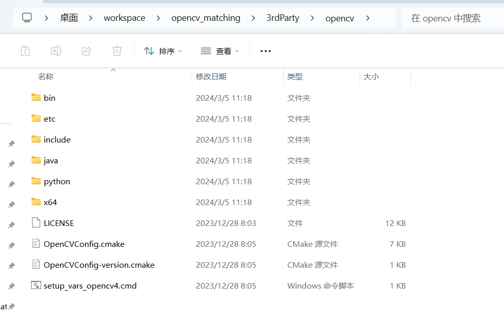

# 模板匹配

- 基于[Fastest Image Pattern Matching](https://github.com/DennisLiu1993/Fastest_Image_Pattern_Matching)

## 改进

1. 封装为更易用的库
2. 跨平台适配

## 计划

- [ ] 优化代码结构
- [x] 支持python

## 编译

### clone代码

git克隆时同步克隆子模块

```shell
git clone --recurse-submodules https://github.com/acai66/opencv_matching.git
```

### 编译代码

使用各种编译cmake的方法(vs2022、vs2019、vs2017、或cmake-gui)编译即可，演示使用vs2022编译，其余工具供参考。

编译演示视频：[B站链接](https://www.bilibili.com/video/BV1hu4m1F7D1)

### 注意事项

- 作者机器上不同项目使用的opencv版本不同，所以没有把opencv添加到系统环境变量中，opencv放进了3rdParty文件夹下，目录结构参考如下：

  

- 如需修改opencv路径，可能需要修改如下信息，具体参考 `CMakeLists.txt` 和 `matcher/CMakeLists.txt` 文件：

  `CMakeLists.txt`

  ```cmake
  if(CMAKE_HOST_SYSTEM_NAME MATCHES "Windows")
    set(OpenCV_DIR ${PROJECT_SOURCE_DIR}/3rdParty/opencv)
  endif()
  ```

  `matcher/CMakeLists.txt`

  ```cmake
  if(WIN32)
  install(FILES 
    ${PROJECT_SOURCE_DIR}/3rdParty/opencv/x64/vc16/bin/opencv_world490.dll
    TYPE BIN 
    DESTINATION ${CMAKE_INSTALL_BINDIR})
  else()
  ```

## 使用

将编译的库集成到其他项目中

编译完成后，可以在安装目录下找到 `templatematching.dll` 和 `templatematching_ctype.dll`

### C++

c++编译时只需要引入头文件即可，dll是在运行时加载的，只需要 `templatematching.dll`，详细调用参考 `demo.cpp`

### python

python使用时需要将 `templatematching.dll` 和 `templatematching_ctype.dll` 放进运行目录，演示代码参考 `py_demo.py`
